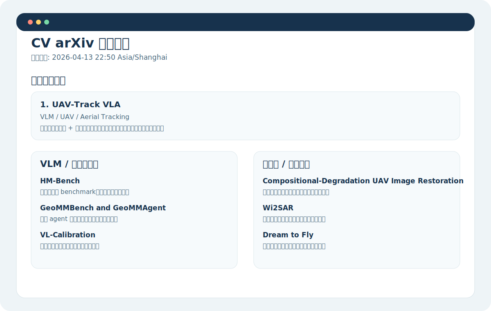

<p align="center">
  
</p>

<h1 align="center">CV ArXiv Assistant</h1>

<p align="center">
  A lightweight Codex skill + script bundle for generating Chinese daily reading briefs from the latest computer vision papers on arXiv.
</p>

<p align="center">
  
  
  
</p>

Instead of dumping a long paper list, this project focuses on fast research triage:

- prioritize what is worth reading first
- group papers by CV subtopic
- write concise Chinese judgments
- keep a reviewer-style novelty score for quick filtering
- list all paper authors and each author's first affiliation when available
- emphasize topics such as object detection, vision-language models, remote sensing, and UAV or drone imagery

## Preview

### Banner

The repository includes a reusable project banner:


### Example Output

Below is a lightweight preview card that shows the intended digest style:



The actual generated markdown will usually include:

- a `Top Papers Today` section
- topic buckets such as VLM, remote sensing, UAV, or detection
- concise Chinese judgments for each selected paper
- all authors plus the first affiliation attached to each author
- novelty scores for triage
- short reading recommendations at the end

## What This Repo Includes

- `skills/cv-arxiv-briefing/SKILL.md`
  The Codex skill definition. It tells Codex how to collect papers, score them conservatively, and write the brief in Chinese.
- `scripts/daily_digest.py`
  A Python script that fetches arXiv RSS feeds, matches topic keywords, enriches author metadata, scores papers, and writes a markdown digest.
- `config/topics.json`
  Topic configuration for feeds and keywords.

## Output Style

The generated brief is designed for daily reading, not archival metadata only. A good output should include:

- short Chinese summaries instead of translated abstracts
- author lists with first affiliations when available in arXiv metadata
- a conservative novelty score from `1/5` to `5/5`
- brief notes on background, motivation, and why the paper is worth reading

## Default Coverage

Current feeds:

- `cs.CV`
- `cs.AI`
- `cs.RO`
- `eess.IV`

Current keyword focus:

- object detection
- vision-language / multimodal reasoning
- remote sensing / geospatial / hyperspectral / SAR
- UAV / drone / low-altitude imagery

You can adjust the focus by editing [`config/topics.json`](./config/topics.json).

## How To Use

### 1. Use it as a Codex skill

Copy or install the skill so Codex can access:

- [`skills/cv-arxiv-briefing/SKILL.md`](./skills/cv-arxiv-briefing/SKILL.md)

Then ask Codex something like:

```text
Generate today's CV arXiv Chinese briefing.
```

or:

```text
Please generate today's CV arXiv Chinese briefing and prioritize remote sensing + UAV papers.
```

### 2. Run the script directly

From the project root:

```bash
python scripts/daily_digest.py --output README.md
```

You can also write to another file:

```bash
python scripts/daily_digest.py --output output/CV-arXiv-brief-2026-04-13.md
```

## Recommended Workflow

1. Tune feeds and keywords in `config/topics.json`.
2. Run `scripts/daily_digest.py` for a first-pass brief.
3. Open the generated markdown and manually refine the highest-priority papers.
4. If needed, ask Codex to rewrite the top section into a sharper Chinese research note.

## Novelty Score Guideline

The score is a quick triage signal, not a formal review:

- `1/5`: mostly incremental, survey-like, or dataset-heavy
- `2/5`: limited novelty but still useful for benchmarking or engineering practice
- `3/5`: clear method contribution and worth reading
- `4/5`: strong idea or strong cross-domain combination
- `5/5`: unusually fresh framing or highly distinctive direction

The project intentionally keeps this score conservative when only the title and abstract are available.

## Example Use Cases

- daily CV paper digestion for Chinese-speaking researchers
- remote sensing and UAV literature watch
- quick VLM trend scanning
- building a recurring daily arXiv briefing automation in Codex

## Customization Ideas

- narrow the digest to one vertical such as remote sensing only
- expand keyword coverage for grounding, segmentation, tracking, or robotics
- write output files with date-based names for daily archives
- connect the script to a scheduled automation that runs every morning

## Notes

- The script uses arXiv RSS feeds, so network access is required when generating a fresh brief.
- Author affiliations are read from arXiv Atom metadata when available. If arXiv does not provide them, the output will explicitly say so instead of guessing.
- The generated output is best treated as a first-pass research assistant, then refined by a human or by a second Codex pass.
- If you use scheduled automations, date-based output filenames are strongly recommended to keep daily records clean.

## License

Add your preferred license here before publishing the repository.
